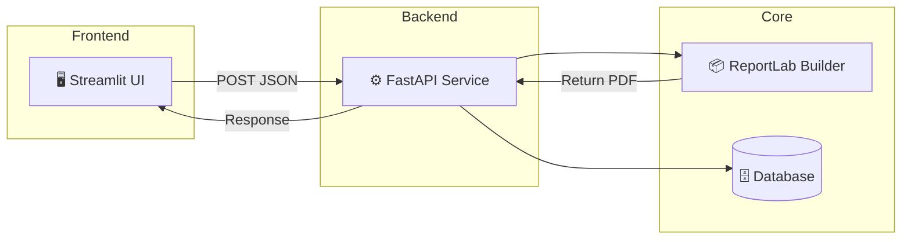

<div align="center">

# 🧩 **Resume Builder**
### FastAPI + Streamlit + ReportLab + PostgreSQL

> 🧠 A modular and intelligent system to create, edit, and export professional resumes as PDF files.

<p align="center">
  
  
  
  
  
</p>

</div>

---

## 🚀 **Overview**

**Resume Builder** is a full-stack platform to design and export resumes (CVs) as dynamic PDFs.  
It combines:

- 🎨 **Streamlit UI** — interactive editor for profile data, sections, and themes  
- ⚙️ **FastAPI Backend** — REST endpoints for PDF generation and data management  
- 🧱 **ReportLab Engine** — pixel-perfect PDF builder with advanced layouts  
- 💾 **PostgreSQL / SQLite** — persistent user profiles and customization settings  

---

## 🧩 **System Architecture**



> 💡 Streamlit communicates with **humans**, FastAPI communicates with **machines** — together they form a complete ecosystem.

---

## 📁 **Folder Structure**

```
build/
├── api/                # FastAPI backend
│   ├── main.py         # API entry
│   ├── routes/         # /profiles, /generate, etc.
│   └── pdf_utils/      # ReportLab-based engine
├── st_app/             # Streamlit frontend
│   ├── app.py          # Main UI
│   ├── core/           # API client & schema tools
│   ├── ui/             # Sidebar & tabs
│   └── widgets/        # Alerts, PDF preview
├── layouts/            # Layout JSONs
├── themes/             # Theme configurations
├── profiles/           # Saved user profiles
└── tools/              # Developer utilities
```

---

## ⚙️ **Setup & Installation**

### 🔹 1. Clone Repository
```bash
git clone https://github.com/TamerOnLine/resume-builder.git
cd resume-builder
```

### 🔹 2. Create Virtual Environment
```bash
python -m venv .venv
source .venv/bin/activate  # Windows: .venv\Scripts\activate
```

### 🔹 3. Install Requirements
```bash
pip install -r requirements/requirements.full.txt
```

### 🔹 4. Run Backend (FastAPI)
```bash
uvicorn api.main:app --reload --port 8000
```
➡️ Open Docs: [http://127.0.0.1:8000/docs](http://127.0.0.1:8000/docs)

### 🔹 5. Run Frontend (Streamlit)
```bash
streamlit run st_app/app.py
```
➡️ Access UI: [http://localhost:8501](http://localhost:8501)

---

## 🧠 **Core Features**

| 🚀 Feature | Description |
|-------------|-------------|
| 🖥️ **Interactive UI** | Live editing with Streamlit |
| ⚙️ **REST API** | `/generate-form-simple` to build PDFs |
| 🧾 **ReportLab Engine** | Precise, professional PDF generation |
| 🧩 **Modular Sections** | Header, Skills, Projects, Education, etc. |
| 🎨 **Themes & Layouts** | Aqua Card, Modern Dark, Pro Clean, etc. |
| 💾 **Database Integration** | PostgreSQL or SQLite |
| 🧪 **Testing & CI/CD** | Pytest + GitHub Actions (E2E coverage) |

---

## 📡 **API Example**

```bash
POST /generate-form-simple
Content-Type: application/json

{
  "theme_name": "aqua-card",
  "profile": {
    "header": {"name": "Tamer OnLine", "title": "Software Developer"},
    "skills": ["FastAPI", "PostgreSQL", "ReportLab"],
    "languages": ["Arabic", "English", "German"]
  }
}
```

➡️ **Response:** PDF bytes (`application/pdf`)

---

## 🧱 **Technology Stack**

| Layer | Technology |
|-------|-------------|
| Frontend | Streamlit |
| Backend | FastAPI |
| Core Engine | ReportLab |
| Database | PostgreSQL / SQLite |
| Language | Python 3.10+ |
| CI/CD | GitHub Actions |

---

## ☁️ **Deployment Options**

| Type | Platform | Description |
|------|-----------|-------------|
| 💻 Local | Streamlit / FastAPI | Run both locally on 8501 & 8000 |
| 🌐 Cloud (Simple) | Streamlit Cloud | Streamlit-only version |
| ⚙️ Cloud (Full) | Render / Railway | FastAPI + Streamlit combo |
| 🧭 Reverse Proxy | Nginx / Traefik | Unified domain (`/` → UI, `/api` → API) |

---

## 🧾 **License**

MIT License © 2025 — [TamerOnLine](https://github.com/TamerOnLine)

---

<div align="center">

### 👤 **Author — Tamer Hamad Faour**
**Software Developer & AI Tool Builder**  
Focused on FastAPI • Streamlit • PostgreSQL • ReportLab  

🌐 [GitHub](https://github.com/TamerOnLine) │ [LinkedIn](https://linkedin.com/in/tameronline)

</div>
