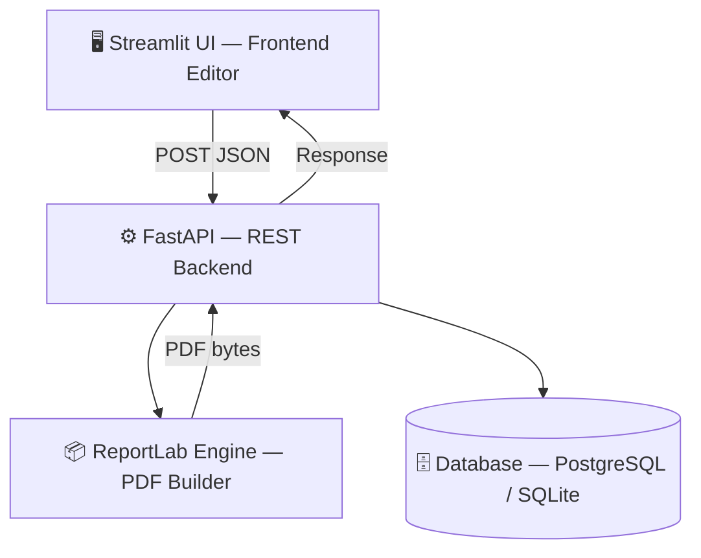

# 🧩 **TamerOnLine Resume Builder**
### AI-Enhanced Resume System built with FastAPI, Streamlit, and ReportLab

> 🧠 Build, customize, and export stunning resumes with intelligent PDF generation and modular design.

---

## 🚀 Overview
**TamerOnLine Resume Builder** is a modern, AI-enhanced platform for creating professional resumes (CVs).  
It combines **Streamlit**, **FastAPI**, and **ReportLab** into a unified system capable of:
- 🎨 Interactive UI for live editing  
- ⚙️ FastAPI backend for data processing and PDF generation  
- 🧾 ReportLab engine for pixel-perfect printing  
- 💾 PostgreSQL/SQLite for persistent user data  
- 🧠 AI-driven formatting and multilingual support (English, Arabic, German)

---

## 🧩 System Architecture

```mermaid
graph TD
    ST[🖥️ Streamlit UI — Frontend Editor]
    API[⚙️ FastAPI — REST Backend]
    PDF[📦 ReportLab Engine — PDF Builder]
    DB[(🗄️ Database — PostgreSQL / SQLite)]
    ST -->|POST JSON| API
    API --> PDF
    API --> DB
    PDF -->|PDF bytes| API
    API -->|Response| ST
```
> 💡 Streamlit talks to humans, FastAPI talks to machines — together they form a complete ecosystem.

---

## ⚙️ Setup & Installation

### 1️⃣ Clone Repository
```bash
git clone https://github.com/TamerOnLine/resume-builder.git
cd resume-builder
```

### 2️⃣ Create Virtual Environment
```bash
python -m venv .venv
source .venv/bin/activate   # Windows: .venv\Scripts\activate
```

### 3️⃣ Install Requirements
```bash
pip install -r requirements/requirements.full.txt
```

### 4️⃣ Run Backend (FastAPI)
```bash
uvicorn api.main:app --reload --port 8000
```
➡️ Open Docs: [http://127.0.0.1:8000/docs](http://127.0.0.1:8000/docs)

### 5️⃣ Run Frontend (Streamlit)
```bash
streamlit run st_app/app.py
```
➡️ Access UI: [http://localhost:8501](http://localhost:8501)

---

## 🧠 Core Features
| Feature | Description |
|----------|--------------|
| 🖥️ Interactive UI | Real-time editing with Streamlit |
| ⚙️ REST API | `/api/generate-form-simple` to build PDFs |
| 🧾 PDF Engine | ReportLab-based, multilingual PDF rendering |
| 🧩 Modular Blocks | Header, Skills, Projects, Education, etc. |
| 🎨 Themes & Layouts | Aqua-Card, Modern-Dark, Pro-Clean |
| 💾 Database Support | PostgreSQL or SQLite |
| 🧪 Testing & CI/CD | Pytest + GitHub Actions workflows |
| 🌍 Multilingual | Arabic, English, German |
| 🧠 AI Integration | Smart formatting and section suggestions |

---

## 📡 Example API Request
```bash
POST /api/generate-form-simple
Content-Type: application/json

{
  "theme_name": "aqua-card",
  "profile": {
    "header": {"name": "Tamer Hamad Faour", "title": "Software Developer"},
    "skills": ["FastAPI", "PostgreSQL", "ReportLab"],
    "languages": ["Arabic", "English", "German"]
  }
}
```

➡️ **Response:** `application/pdf`

---

## 🧱 Technology Stack
| Layer | Technology |
|-------|-------------|
| Frontend | Streamlit |
| Backend | FastAPI |
| Core Engine | ReportLab |
| Database | PostgreSQL / SQLite |
| Language | Python 3.10+ |
| CI/CD | GitHub Actions |

---

## ☁️ Deployment Options
| Type | Platform | Description |
|------|-----------|-------------|
| 💻 Local | FastAPI + Streamlit | Full local development |
| 🌐 Cloud (UI Only) | Streamlit Cloud | Hosted Streamlit front-end |
| ⚙️ Cloud (Full Stack) | Render / Railway | Backend + Frontend deployment |
| 🧭 Reverse Proxy | Nginx / Traefik | Route `/` → UI, `/api` → FastAPI |

---

## 🧾 License
MIT License © 2025 — [TamerOnLine](https://github.com/TamerOnLine)

---

### 👤 **Author — Tamer Hamad Faour**
**Software Developer & AI Tool Builder**  
Focused on **FastAPI • Streamlit • PostgreSQL • ReportLab**

🌐 [Website](https://tamer.dev) │ [GitHub](https://github.com/TamerOnLine) │ [LinkedIn](https://linkedin.com/in/tameronline)
