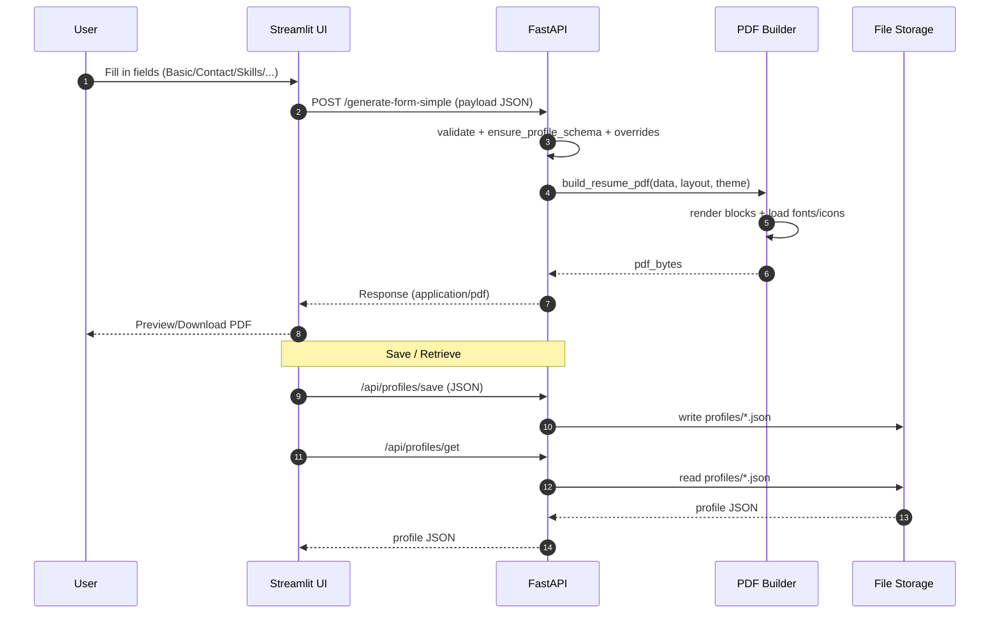

# Architecture

This page documents the **high-level architecture**, **data flow**, and **CI/CD pipeline** of the **FastAPI + Streamlit Resume Builder** project.  
You can copy this file as `docs/architecture.md` and include it in your MkDocs navigation (see the last section).

---

## 1) System Architecture (High-Level)
```mermaid
graph TD
  subgraph User["User"]
    U1[Web Browser Interface]
  end

  subgraph Streamlit["Streamlit UI (st_app)"]
    S1[ui/tabs: basic/contact/skills/projects/education/...]
    S2[core/api_client.py<br/>build_payload + PDF preview]
    S3[config/ui_defaults.py<br/>default values]
  end

  subgraph FastAPI["FastAPI API (api)"]
    A1[api/main.py<br/>/healthz<br/>/generate-form-simple]
    A2[routes/profiles.py<br/>CRUD for profile files]
    A3[models/profile.py<br/>Pydantic Schemas]
  end

  subgraph PDF["PDF Engine (api/pdf_utils)"]
    P0[builder.py / resume.py]
    P1[blocks/*<br/>(header_name, key_skills,<br/>projects, education, ...)]
    P2[layout_engine.py]
    P3[themes/*]
    P4[layouts/*]
    P5[assets (fonts/icons)]
  end

  subgraph Storage["Profiles & Outputs"]
    F1[profiles/*.json]
    F2[outputs/*.pdf]
  end

  U1 -->|enters data| S1
  S1 --> S2
  S2 -->|POST JSON| A1
  A1 -->|normalize + validate| A3
  A1 -->|select layout/theme| P2
  P2 --> P0
  P0 --> P1
  P1 -->|uses| P5
  P0 -->|generates| F2
  A2 <-->|save/load| F1
  S2 -->|preview/download| F2
```

---

## 2) Data Flow (Input → View → Save → Print)


---

## 3) CI/CD Pipeline (Tests • Blocks Smoke • E2E • Docs)
```mermaid
flowchart LR
  A[push/pr] --> T[ci-tests.yml<br/>Unit Tests (Windows + Ubuntu • Py 3.10–3.13)]
  A --> B[ci-blocks.yml<br/>generate-matrix → smoke for each block]
  A --> E[ci-e2e.yml<br/>Input → View → Save → Print + coverage.xml]
  D[docs.yml<br/>MkDocs Build & Deploy] -->|publish| G[GitHub Pages]

  B -->|PDF artifacts| H[Artifacts]
  E -->|coverage.xml + final_resume.pdf| H
```

---

## 4) Notes & Conventions
- **Themes/Layouts:** Selected either via `layout_inline` in the payload or from `layouts/*.json` and `themes/*.json`.
- **i18n/RTL:** Supports Arabic (RTL), English, and German through `ui_lang` and `rtl_mode`.
- **Blocks System:** Each block handles a visual component (Header, Skills, Projects, Education, etc.).
- **Profiles:** Stored as JSON files but can later be linked to a PostgreSQL database.

---

## 5) Add to MkDocs Navigation
Add the page to your `mkdocs.yml` under the **Docs** section:

```yaml
nav:
  - Home: index.md
  - Usage:
      - Quick Start: usage/quick_start.md
  - Architecture: architecture.md
  - API:
      - Builder: api/builder.md
      - Profiles: api/profiles.md
  - Blocks:
      - Catalog: blocks/catalog.md
```

> **Note:** Make sure Mermaid is enabled in MkDocs (usually through `pymdownx.superfences`).  
> Example configuration snippet:

```yaml
markdown_extensions:
  - admonition
  - pymdownx.superfences
  - pymdownx.details
  - toc:
      permalink: true
```

---

## 6) Optional: README Badge / Architecture Reference
If you want to mention this page in your README, you can add a short section:

```md
> For detailed architecture and CI/CD overview, see [Architecture](./docs/architecture.md).
```

---

### ✅ Ready!
Copy this content into `docs/architecture.md` and run:
```bash
mkdocs serve
```
to preview the page locally, or push your changes to the `main` branch to publish automatically to **GitHub Pages** (if `docs.yml` is enabled).
