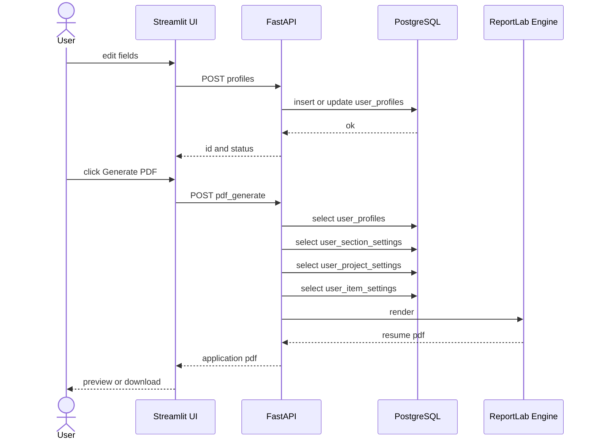
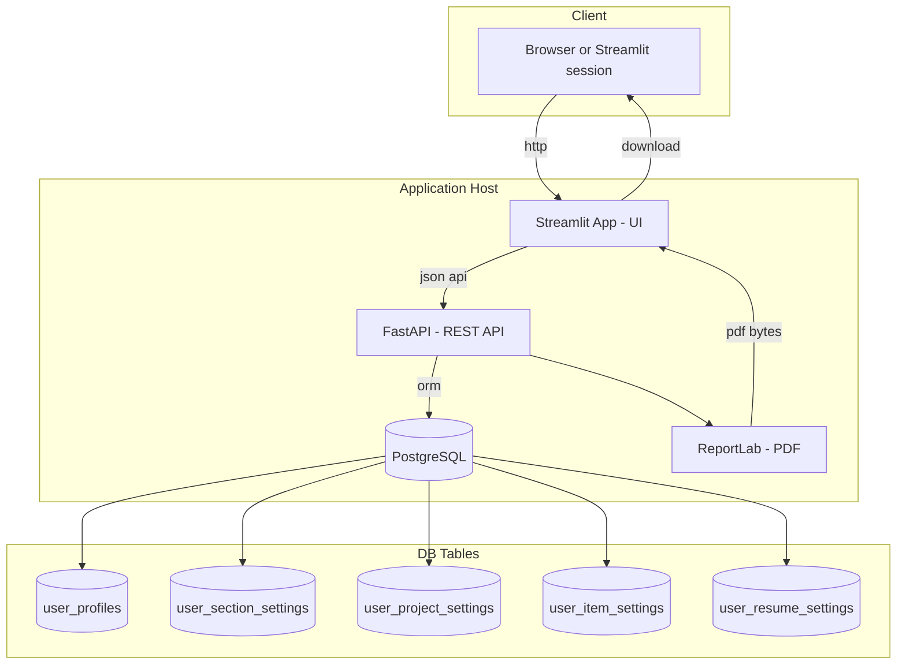

# Architecture (Mermaid for GitHub – safe labels)

This variant avoids characters that break old Mermaid on GitHub: no `{}`, `/`, `()` in node texts or edge labels.

---

## 1) Data Flow Diagram (endpoints + tables)
```mermaid
flowchart LR
  U[User] -->|inputs| UI[Frontend - Streamlit UI]

  UI -->|POST /generate-form-simple| API1[FastAPI generate-form-simple]
  UI -->|GET /api/profiles/{id}| API2[FastAPI profiles-id]
  UI -->|POST /api/profiles| API6[FastAPI profiles]
  UI -->|PATCH /api/profiles/{id}| API7[FastAPI profiles-id]
  UI -->|PATCH /api/settings/sections| API3[FastAPI settings-sections]
  UI -->|PATCH /api/settings/projects| API4[FastAPI settings-projects]
  UI -->|PATCH /api/settings/items| API5[FastAPI settings-items]

  subgraph Backend [Backend - FastAPI Layer]
    API1
    API2
    API3
    API4
    API5
    API6
    API7
    PDF[PDF Engine - ReportLab]
    DB[(PostgreSQL)]
  end

  API1 -->|merge settings| DB
  API2 -->|crud user_profiles| DB
  API3 -->|update user_section_settings| DB
  API4 -->|update user_project_settings| DB
  API5 -->|update user_item_settings| DB
  API6 -->|insert user_profiles| DB
  API7 -->|update user_profiles| DB

  API1 --> PDF
  PDF -->|pdf bytes| UI
  UI -->|download| U
```

---

## 2) Request Sequence (generate PDF)


---

## 3) Deployment Diagram

