# Architecture (Interactive)

This page documents the **end‑to‑end architecture** of the Resume Builder (Streamlit UI + FastAPI + PostgreSQL + ReportLab), with **interactive Mermaid diagrams** and **deep links** to source folders.

> Save this file as `docs/architecture.md` and publish with MkDocs. The diagrams are compatible with GitHub and MkDocs Material (Mermaid enabled).

---

## 🔗 Quick Links
- **Repo root**: <https://github.com/TamerOnLine/build>
- **UI (Streamlit)**: `st_app/`
- **API (FastAPI)**: `api/`
- **DB & Migrations**: `db/` (SQLAlchemy + Alembic)
- **Templates (resume)**: `templates/`
- **Two‑column dynamic scripts**: `templates/two-column-dynamic/scripts/`
- **Docs site**: <https://tameronline.github.io/build/>

---

## 1) Data Flow Diagram — with endpoints & tables

> Edit online in Mermaid Live: <https://mermaid.live>

```mermaid
flowchart LR
  U[👤 User] -->|Inputs / Clicks| UI[Frontend — Streamlit UI]

  UI -->|POST /pdf/generate| API1[FastAPI — /pdf/generate]
  UI -->|GET /profiles/:id| API2[FastAPI — /profiles/:id]
  UI -->|POST /profiles| API6[FastAPI — /profiles]
  UI -->|PATCH /profiles/:id| API7[FastAPI — /profiles/:id]
  UI -->|PATCH /settings/sections| API3[FastAPI — /settings/sections]
  UI -->|PATCH /settings/projects| API4[FastAPI — /settings/projects]
  UI -->|PATCH /settings/items| API5[FastAPI — /settings/items]

  subgraph Backend[Backend — FastAPI Layer]
    API1
    API2
    API3
    API4
    API5
    API6
    API7
    PDF[PDF Engine (ReportLab)]
    DB[(PostgreSQL)]
  end

  API1 -->|SELECT + Merge Settings| DB
  API2 -->|CRUD user_profiles| DB
  API3 -->|UPDATE user_section_settings| DB
  API4 -->|UPDATE user_project_settings| DB
  API5 -->|UPDATE user_item_settings| DB
  API6 -->|INSERT user_profiles| DB
  API7 -->|UPDATE user_profiles| DB

  API1 --> PDF
  PDF -->|resume.pdf bytes| UI
  UI -->|Preview / Download| U
```

**Key Tables**

| Table | Purpose |
|---|---|
| `user_profiles` | Stores the full resume profile (name, summary, education, projects, skills…). |
| `user_section_settings` | Per‑user visibility & ordering of sections. |
| `user_project_settings` | Per‑user overrides for project blocks. |
| `user_item_settings` | Per‑user overrides for sub‑items (bullets, links…). |
| `user_resume_settings` | Global per‑user print/layout/theme settings. |

---

## 2) Detailed Request Sequence — generate PDF

```mermaid
sequenceDiagram
  actor User as 👤 User
  participant UI as 🖥️ Streamlit UI (st_app)
  participant API as ⚙️ FastAPI (api)
  participant DB as 🗄️ PostgreSQL (db)
  participant PDF as 🧾 ReportLab Engine

  User->>UI: Edit fields (profile, theme, layout)
  UI->>API: POST /profiles (create or update)
  API->>DB: INSERT/UPDATE user_profiles
  DB-->>API: OK
  API-->>UI: {id, status}

  User->>UI: Click "Generate PDF"
  UI->>API: POST /pdf/generate {profile_id, theme, layout}
  API->>DB: SELECT * FROM user_profiles WHERE id=...
  API->>DB: SELECT * FROM user_section_settings WHERE user_id=...
  API->>DB: SELECT * FROM user_project_settings WHERE user_id=...
  API->>DB: SELECT * FROM user_item_settings WHERE user_id=...
  API->>PDF: render(profile, settings, theme, layout)
  PDF-->>API: resume.pdf (bytes)
  API-->>UI: application/pdf
  UI-->>User: Preview / Download
```



---

## 3) Deployment & Responsibility Matrix

```mermaid
graph TB

  subgraph Client[🌐 Client]
    B[Browser / Streamlit Session]
  end

  subgraph Host[🖥️ App Host]
    ST[Streamlit App — UI]
    FA[FastAPI — REST API]
    RP[ReportLab — PDF]
    PG[(PostgreSQL)]
  end

  subgraph DB_Tables[📚 DB Tables]
    T1[(user_profiles)]
    T2[(user_section_settings)]
    T3[(user_project_settings)]
    T4[(user_item_settings)]
    T5[(user_resume_settings)]
  end

  B -->|HTTP| ST
  ST -->|JSON (GET/POST/PATCH)| FA
  FA -->|SQLAlchemy ORM| PG
  PG --> T1
  PG --> T2
  PG --> T3
  PG --> T4
  PG --> T5
  FA --> RP
  RP -->|PDF bytes| ST
  ST -->|Download| B
```

**Ownership / Folders**

| Layer | Responsibility | Key Paths |
|---|---|---|
| UI (Frontend) | Forms, live preview, payload building | `st_app/ui/*`, `st_app/core/api_client.py`, `st_app/config/ui_defaults.py` |
| API (Backend) | Endpoints, validation, orchestration | `api/main.py`, `api/routes/*`, `api/models/*` |
| PDF Engine | Render A4 PDFs with themes/layouts | `api/pdf_utils.py`, `templates/*` |
| Database | Persist profiles & per‑user settings | `db/models/*`, `db/alembic/*` |

---

## 4) Endpoint Index (suggested)

> Adjust to match your current routes.

```text
GET    /healthz
POST   /profiles
GET    /profiles/:id
PATCH  /profiles/:id
PATCH  /settings/sections
PATCH  /settings/projects
PATCH  /settings/items
POST   /pdf/generate
```

---

## 5) MkDocs Integration

Add to `mkdocs.yml`:

```yaml
site_name: Build Docs
repo_url: https://github.com/TamerOnLine/build
theme:
  name: material
  features:
    - navigation.instant
    - navigation.tracking
    - navigation.sections
    - search.suggest
    - search.highlight
markdown_extensions:
  - admonition
  - pymdownx.details
  - pymdownx.superfences
  - pymdownx.tabbed
  - toc:
      permalink: true
plugins:
  - search
  - mermaid2
nav:
  - Home: index.md
  - Architecture: architecture.md
```

> Ensure Mermaid support: install `mkdocs-mermaid2-plugin` and enable `mermaid2` plugin.

```bash
pip install mkdocs-material mkdocs-mermaid2-plugin
mkdocs serve
```

---

## 6) Developer Notes
- All per‑element print customizations are **per‑user** (see `user_section_settings`, `user_project_settings`, `user_item_settings`).
- Keep themes/layouts under `templates/`; dynamic scripts for two‑column variant live in `templates/two-column-dynamic/scripts/`.
- Prefer SQLAlchemy + Alembic for migrations (`db/alembic`).
- API should validate payloads with Pydantic models in `api/models/`.

---

## 7) Future Enhancements
- Add `/profiles/:id/export` to export JSON of a profile.
- Add `/settings/preview` to return a signed preview image of the first PDF page.
- Add `/themes` and `/layouts` discovery endpoints for the UI.
