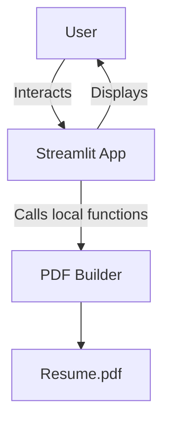
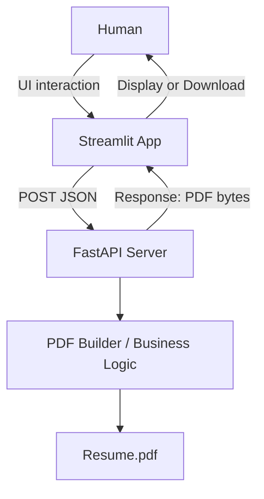
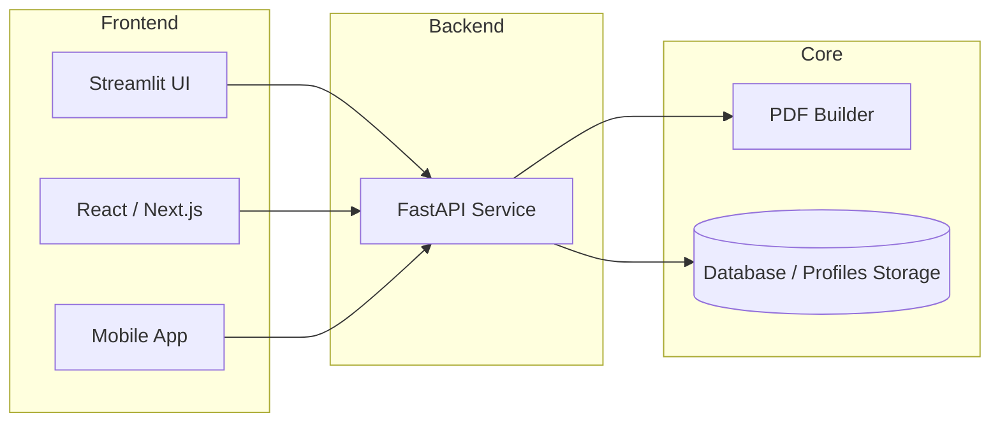

# Streamlit vs FastAPI — Architecture Overview (Fixed Mermaid)

## Concept Summary

- **Streamlit talks to humans (UI).**  
- **FastAPI talks to machines (API).**

When combined, they form a **multi-interface system** — one backend serving multiple frontends.

---

## Case 1 — Streamlit Only

- The Streamlit app is the entire project (UI + logic).
- Users interact via the browser; the app generates the PDF locally.

---

## Case 2 — Streamlit + FastAPI

- FastAPI acts as the backend engine (API).
- Streamlit is one of many possible frontends.
- Any client (React, mobile, CLI, automation) can consume the API.

---

## Layered Architecture (Professional Layout)

---

## Technical Breakdown

| Layer | Component | Role | Communicates With |
|--------|------------|------|------------------|
| Presentation (UI) | Streamlit / React / Mobile | Human interaction | FastAPI |
| Backend Service | FastAPI | Business logic, APIs | All frontends |
| Core Engine | PDF Builder (ReportLab / pdf_utils) | PDF generation | FastAPI / Streamlit |
| Storage | Database / JSON Profiles | Data persistence | FastAPI |

---

## Summary

| Approach | Description | Example Use |
|-----------|--------------|--------------|
| Streamlit Only | Single app that talks directly to users. | Local resume builder, dashboards |
| FastAPI + Streamlit | Frontend (Streamlit) + Backend (FastAPI) separation. | Public platform, multi-client system |
| FastAPI Only | Headless backend service for automation. | Integration into other systems |
